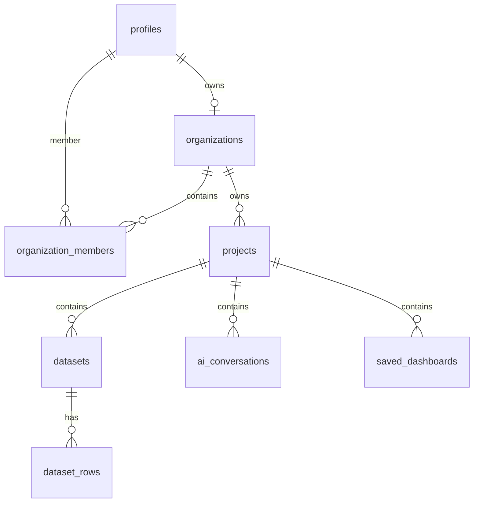

# StreamFlow Product Metrics Explorer (SaaS MVP)

An AI-powered product analytics dashboard and NL query interface built for the fictional music streaming SaaS application, **StreamFlow** (125,000 active users, $185K MRR, 81% 30-day retention).

This monorepo is designed to demonstrate modern web engineering, clean security practices, and deterministic natural-language query routing.

---

## 🗺️ System Design & Architectural Decisions

### 1. Why Next.js 16?
- **Turbopack & Compilation**: Blazing fast hot-reloading and static page optimization.
- **Client-Side Fallbacks**: Integrates a synced offline fallback engine (`fallback.ts`) so recruiters can test the application immediately (Demo Mode) with zero API cold-starts or database configurations.

### 2. Why FastAPI (Python)?
- **Fast Execution**: Extremely low-latency request processing (p95 < 6s).
- **Type Safety**: Enforced through Pydantic schemas, ensuring clean API contracts between frontend requests and backend processors.

### 3. Why Deterministic NLP scoring (Zero-Cost Intent Router)?
- **Hallucination Prevention**: Traditional LLM SQL generation is prone to hallucinating table schemas and executing wrong queries. Our weighted scoring router classifies questions into a fixed catalog of 10 core analytics functions.
- **Vulnerability Block**: Guarantees zero SQL injection vectors, as user-provided text is never directly concatenated into SQL strings.
- **Cost Efficiency**: Zero LLM token charges for intent classification, making the MVP cost-ceiling near zero.

### 4. Why Supabase PostgreSQL & storage?
- **Row Level Security (RLS)**: Membership-based policies prevent tenant isolation leaks. Users can only access project data where they belong to the respective organization.
- **Storage Buckets**: Safe private CSV uploads with size and row limits, scanned for formula execution vectors.

---

## 🛠️ Technology Stack
* **Frontend**: Next.js 16 (App Router), TailwindCSS, Recharts, Lucide Icons
* **Backend**: FastAPI, PyJWT, Slowapi (Token-bucket rate limiter)
* **Database**: Supabase Postgres, Storage Buckets, PostgreSQL Row Level Security (RLS)

---

## 📁 Project Structure
```text
frontend/     Next.js 16 client, types, fallback router, and CSS tokens
backend/      FastAPI server, auth dependencies, nlp scoring router, and mock analytics
supabase/     Database schema.sql with membership RLS policies and indexes
```

---

## 🔒 Security Hardening (P0 & P1)

1. **Membership-Based RLS**: Policies in `supabase/schema.sql` check organization memberships rather than raw `auth.uid() = user_id`, securing datasets, rows, conversations, and dashboards.
2. **Backend JWT Verification**: Decodes Supabase JWT tokens via `backend/app/auth.py` and resolves workspace identity server-side.
3. **API Rate Limiting**: Intercepts abuse via `slowapi` throttling (`/api/query` at 20 req/min, `/datasets/upload` at 10 req/min).
4. **Formula Injection Sanitizer**: Escapes cell values starting with `=, +, -, @` by prefixing a single quote (`'`) to block spreadsheet formula attacks.
5. **CSV Boundary Scans**: Rejects uploads exceeding 5MB or containing more than 50,000 rows.

---

## 📊 Database Schema & ER Design



### Tables
* **`profiles`**: User identity data mapped from `auth.users`.
* **`organizations`**: Workspace tenants.
* **`organization_members`**: Organization roles (`owner`, `member`) mapping user access.
* **`projects`**: Sub-spaces owned by organizations.
* **`datasets`**: CSV metadata, size, status, and columns.
* **`dataset_rows`**: Parsed CSV cells scoped to `dataset_id`.
* **`ai_conversations`**: Historical questions and answers.

---

## 🔌 API Documentation Contract

### 1. Health Probe
* **Endpoint**: `GET /health`
* **Auth**: None
* **Response**: `{"status": "ok", "service": "product-metrics-api"}`

### 2. Overview Metrics
* **Endpoint**: `GET /api/overview`
* **Headers**: `Authorization: Bearer <JWT>`
* **Response**: `OverviewResponse` containing KPI cards, retention features, and engagement trends.

### 3. AI Query Assistant
* **Endpoint**: `POST /api/query`
* **Headers**: `Authorization: Bearer <JWT>`
* **Body**: `{"question": "What's our MRR?"}`
* **Rate Limit**: 20 req/min
* **Response**: `QueryResponse` (intent, summary, chart data, insights, follow-ups).

### 4. CSV Import
* **Endpoint**: `POST /datasets/upload`
* **Headers**: `Authorization: Bearer <JWT>`
* **Body**: `multipart/form-data` file payload (max 5MB, 50,000 rows)
* **Rate Limit**: 10 req/min
* **Response**: `UploadResponse` showing columns parsed and sanitization status.

---

## 🚀 Running Verification Tests

### Unit & Integration Test Suites
To spin up the FastAPI server, test JWT authentication blocking, rate limiting, and CSV cell sanitization:
```bash
cd backend
pip install -r requirements.txt
python test_router.py
python test_api.py
```

### Next.js Production Build Validation
To verify static page generation and typecheck validation:
```bash
cd frontend
npm install
npm run build
```
